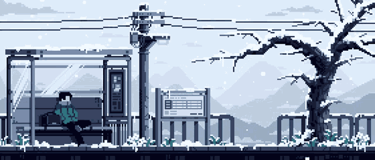

<h1 align="center">Hi 👋, I'm Tapashi Dhar</h1>
<h3 align="center">Beginner Developer | CSE (Data Science) Student @ BWU'27 | Exploring AI & Technology 🚀</h3>

  

### 🤝 Connect With Me

  
  
  

<!-- Proudly created with GPRM ( https://gprm.itsvg.in ) --> 

---

<table>
<tr>
<td width="30%" align="center">

</td>

<td width="70%">

### 🧠 About Me

I'm a **B.Tech CSE (Data Science) student at Brainware University**, currently exploring the world of software development, AI, and data science. I'm focused on learning by building projects, contributing to open source, and continuously improving my technical skills.

* 🔭 I'm currently working on **AI, Data Science & Development projects**
* 🌱 I'm learning **Python, SQL, JavaScript, React & AI/ML**
* 🤖 I'm exploring **LLMs, RAG, APIs & Generative AI**
* 💻 I'm building my skills in **Full-Stack Development & Data Science**
* 🌍 I'm interested in **Open Source & collaborative projects**
* 🚀 I believe in **learning, building, breaking things, and improving**
* 📧 Reach me at : tapashidhar2004@gmail.com

</td>
</tr>
</table>

  

---
# Building Things I Probably Should’ve Planned First 🛠️  
 **Somewhere Between Hello World and Production** 

 

  
  

---

## 🚀 What I Know

### ⚡ Languages

  

### ⚡ Tools and Technologies

 

  

### 💭 Random Dev Quote

<!-- Ending -->

<picture>
  <source media="(prefers-color-scheme: dark)" srcset="https://github.com/AuroraBytesX/AuroraBytesX/blob/output/github-snake-dark.svg" />
  <source media="(prefers-color-scheme: light)" srcset="https://github.com/AuroraBytesXr/AuroraBytesX/blob/output/github-snake.svg" />
  
</picture>

# Thanks for visiting,Amigo!
---

